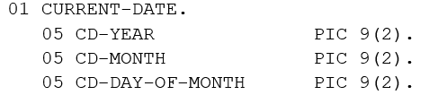
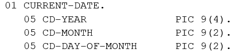
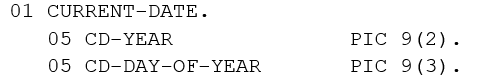
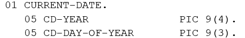
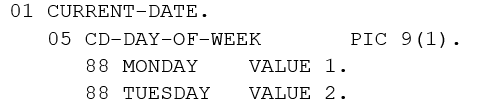

<!--navi start1-->
[前へ](6-4-4.md)/[目次](https://opensourcecobol.github.io/markdown/TOC.html)/[次へ](6-4-6.md)
<!--navi end1-->
### 6.4.5. ACCEPT文の書き方5 ― 日付/時刻の取得

|図6-22-ACCEPT構文(日付/時刻の取得)構文|
|:--|
||

システムの現在の日付や時刻を取得してデータ項目に保存するために使用する。

1. システムから取得したデータ、および構造化された書き方は、次の表のように異なっている。

    表6-23-ACCEPTオプション(日付/時刻の取得)

    |オプション|取得データ|一意名-1の書き方|
    |---|---|---|
    |DATE|グレゴリオ暦表示の日付||
    |DATE YYYYMMDD|グレゴリオ暦表示の日付||
    |DAY|ユリウス暦表示の日付||
    |DAY YYYYDDD|ユリウス暦表示の日付||
    |DAY-OF-WEEK|曜日||

<!--navi start2-->

[ページトップへ](6-4-5.md)
<!--navi end2-->
