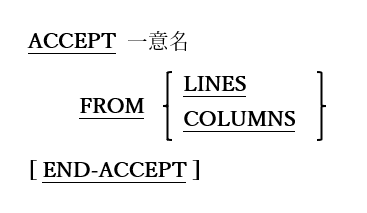

### 6.4.6. ACCEPT文の書き方6 ― 画面サイズデータの取得

図6-24-ACCEPT(画面サイズデータの取得)構文

プログラムが実行されているコンソールウィンドウの(文字位置での)表示可能なサイズを取得するために使用する。

1. Windowsコンソールウィンドウなど、ウィンドウの論理サイズが物理コンソールウィンドウの論理サイズをはるかに超える可能性のある環境では、物理コンソールウィンドウのサイズを取得する。
