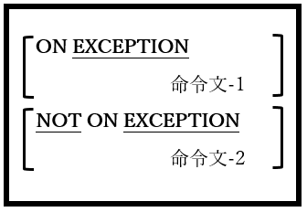

<!--navi start1-->
[前へ](6-4-6.md)/[目次](https://opensourcecobol.github.io/markdown/TOC.html)/[次へ](6-5-1.md)
<!--navi end1-->
### 6.4.7. ACCEPT文の例外処理

図6-25-ACCEPT例外処理構文

ACCEPT文の一部の書き方においてEXCEPTION句とNOTEXCEPTION句が利用可能で、ACCEPT文の失敗または成功時に実行されるコードを(それぞれ)指定できる。ACCEPT文ではリターンコードまたはステータスフラグを設定しないため、これが成功と失敗を検出する<u>唯一の</u>方法となる。

<!--navi start2-->

[ページトップへ](6-4-7.md)
<!--navi end2-->
