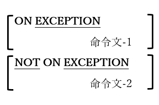

### 6.4.7. ACCEPT文の例外処理

図6-25-ACCEPT例外処理構文

ACCEPT文の一部の書き方においてEXCEPTION句とNOTEXCEPTION句が利用可能で、ACCEPT文の失敗または成功時に実行されるコードを(それぞれ)指定できる。ACCEPT文ではリターンコードまたはステータスフラグを設定しないため、これが成功と失敗を検出する<u>唯一の</u>方法となる。
