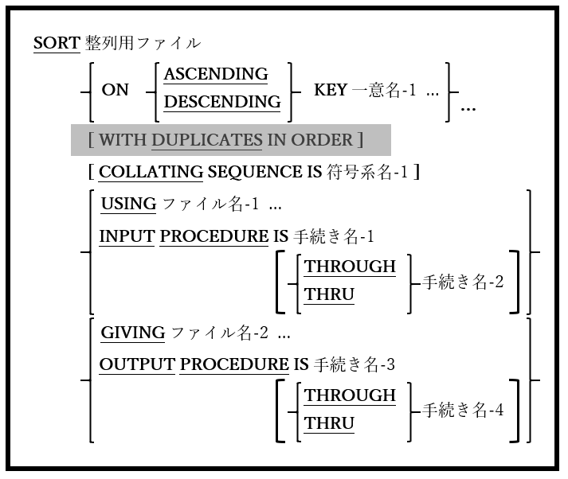

<!--navi start1-->
[前へ](6-39-7.md)/[目次](https://opensourcecobol.github.io/markdown/TOC.html)/[次へ](6-40-2.md)
<!--navi end1-->
## 6.40. SORT

### 6.40.1. SORT文の書き方1 ― ファイルソート

図6-94-SORT構文(ファイルソート)

一つ以上のキー項目に従って、大量のデータを整列することができる。

1. SORT文で指定された整列ファイルは、データ部のファイル節でソート記述(SD)を使用って定義する必要がある([5.2](5-2.md)を参照)。このファイルは「整列ファイル」と呼ばれる。

2. 指定する場合、ファイル名-1およびファイル名-2は、ORGANIZATION LINE SEQUENTIALまたはORGANIZATION RECORD BINARY SEQUENTIALファイルを参照する必要がある。これらのファイルは、データ部のファイル節のファイル記述(FD)を使って定義する必要がある([5.1](5-1.md#51-ファイル記述)を参照)。ファイル名-1とファイル名-2に同じファイルを使うことができる。

3. 一意名-1 ･･･項目は、整列ファイルのレコード内の項目として定義する必要がある。

4. WITH DUPLICATES IN ORDER句は互換性の目的でサポートされているが、機能はしない。

5. 整列ファイル(1項を参照)がOPENまたはCLOSEされることはない。

6. SORT文は次の3段階の働きがある。

    ステージ1(入力フェーズ)：

    a. 整列されるデータは、整列ファイルにロードされる。USING句で指定されたファイルの内容全体を取得するか、手続き名1または手続き名-1 THRU 手続き名-2として定義されたINPUT PROCEDUREを使うことによって達成される。

    b. USINGを指定する場合、SORTの実行時にファイル名-1 ･･･をOPENにすることはできない。

    c. INPUT PROCEDUREを使うと、整列されるレコードは必要なロジックを用いて生成され、RELEASE文([6.34](6-34.md))を使うことで整列ファイルに一度につき一つずつ手動で書き込まれる。

    d. INPUT PROCEDURE内で実行されたSTOP RUN、EXIT PROGRAM、またはGOBACKは、現在実行中のプログラムとSORT文を終了する。

    e. INPUT PROCEDUREから制御を移すGO TO文は、SORT文を終了するが、GO TOが制御を移した位置からプログラムの実行を継続できるようにする。GO TOを使ってINPUT PROCEDUREを中止すると、再開することはできなくなるが、SORT文自体を再実行することはできる。この方法でSORT文を再起動すると、以前整列ファイルにリリースされたレコードはすべて失われてしまう。**_GO TOを使って整列を早期に終了したり、以前に中止したSORT文を再開したりすることは、優れたプログラミングとは見なされないため、回避しなければならない。_**

    f. データが整列ファイルにロードされると、<u>実際には</u>動的に割り当てられたメモリにバッファリングされる。整列されるデータの量が使用可能なソートメモリ量(128MB)`24`を超える場合にのみ、実際のディスクファイルが割り当てられて使用される。これらの「整列作業ファイル」については、後ほど説明する。

    g. INPUT PROCEDUREは、手続き名-2(ない場合は手続き名-1)の最後の文を過ぎた後、制御のフォールスルーによって暗黙的に終了するか、手続き名-2(ない場合は手続き名-1)で実行されるEXIT SECTION/EXIT PARAGRAPHを介して明示的に終了する。INPUT PROCEDUREが終了したところで、入力フェーズが完了する。

    h. INPUT PROCEDUREの範囲内では、ファイルのSORT、MERGE([6.27](6-27.md))、またはRETURN([6.35](6-35.md))を実行できない。

    ステージ2(ソートフェーズ)：

    a. 整列は、(存在する場合は)SORT文で指定されたCOLLATING SEQUENCEに従って、SORT文内のASCENDING KEYまたはDESCENDING KEYによって定義した順序でデータレコードを配置することで処理が行われる。何も定義されていない場合は、実行用計算機段落によって、PROGRAM COLLATING SEQUENCEが指定、または暗示される。キーは、レベル78またはレベル88のデータ項目を除いて、サポートされているものであれば、任意のデータ型とUSAGEを設定することができる。

    b. 例えば、一連の金融取引の流れを整列してみると、SORT文は次のようになる。

        SORT Sort-File
            ASCENDING KEY Transaction-Date
            ASCENDING KEY Account-Number
            DESCENDING KEY Transaction-Amount
            .
            .
            .

     このSORT文の効果は、すべての取引を、取引が発生した日付の昇順(過去から最新へ)に整列することである。このプログラムを利用している企業が廃業しない限り、特定の日付で多くの取引が発生する可能性があるため、同じ日付の取引の各グループ内で、取引が行われた口座番号の昇順でサブソートされる。特定の日付に特定の口座で複数の取引が行われる可能性は非常に高いため、第3レベルのサブソートでは、同じ日付の同じ口座のすべての取引を、実際の取引額の降順(最高額から最低額へ)に整列する。2009年8月31日に口座＃12345で100.00ドルの取引が二件以上記録された場合、整列キーに追加の「レベル」が指定されていないため、これらの取引が互いにどのように順序付けられているかを正確に予測する方法がない。

    c. opensource COBOLは、メインフレームコンピュータシステムのように、大容量で高性能な(そして高額な)整列用パッケージを使わないが、利用しているSORTアルゴリズム`25`はこのタスクには十分すぎるほどである。

    ステージ3(出力フェーズ)：

    a. ソートフェーズが完了すると、GIVING句が指定されている場合は整列済みデータがファイル名-2に書き込まれるか、OUTPUT PROCEDUREを使って手続き名-3または手続き名-3 THRU 手続き名-4として定義される。

    b. GIVING句を指定する場合、SORT文の実行時にファイル名-2 ･･･をOPENにしてはならない。

    c. OUTPUT PROCEDUREを使用する場合、整列済みレコードは、RETURN文([6.35](6-35.md))を使うことで整列ファイルに一度につき一つずつ手動で読み取られる。

    d. OUTPUT PROCEDURE内で実行されたSTOPRUN、EXIT PROGRAM、またはGOBACKは、実行中のプログラムとSORT文を終了する。

    e. 制御をOUTPUT PROCEDUREから転送するGO TO文はSORT文を終了するが、GO TOが制御を転送した位置からプログラムの実行を継続できるようにする。GO TOを使ってOUTPUT PROCEDUREを中止すると、再開することはできないが、SORT文自体を再実行することはできる。この方法でSORT文を再起動すると、整列ファイルから未返却のレコードはすべて失われてしまう。**_GO TOを使って整列を早期に終了したり、以前に中止したSORT文を再開したりすることは、優れたプログラミングとは見なされないため、回避しなければならない。_**

    f. OUTPUT PROCEDUREは、手続き名-4(ない場合は手続き名-3)の最後の文を過ぎた後、制御のフォールスルーによって暗黙的に終了するか、手続き名-4(ない場合は手続き名-3)で実行されるEXIT SECTION/EXIT PARAGRAPHを介して明示的に終了する。OUTPUT PROCEDUREが終了したところで、出力フェーズおよびSORT文自体が完了する。

    g. OUTPUT PROCEDUREの範囲内では、ファイルのSORT、MERGE([6.27](6-27.md))、またはRELEASE([6.34](6-34.md))を実行できない。

7. 整列されるデータの量によってディスク作業ファイルが必要な場合、TMPDIR、TMP、またはTEMP環境変数([7.2.4](7-2.md)を参照)によって定義されたフォルダー内のディスクに自動的に割り当てられる。ディスクファイルは、プログラムの実行終了時に自動的にパージされることはない。一時的な整列用ファイルは、自分で、または整列の終了時にプログラム内から削除する場合に備えて、「cobxxxx.tmp」という名前が付けられる。

---
`24` 整列プロセスにはメモリを割り当てるためのランタイム環境変数(COB_SORT_MEMORY)がある([7.2.4](7-2.md)を参照)。

`25` opensource COBOLソートルーチンは、opensource COBOLランタイムライブラリから完全に補うことができる。

<!--navi start2-->

[ページトップへ](6-40-1.md)
<!--navi end2-->
