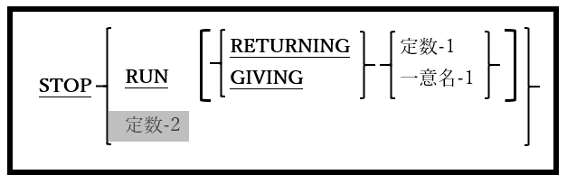

## 6.42. STOP

図6-97-STOP構文

STOP文はプログラムを停止し、オペレーティングシステムに制御を戻す。

1. RETURNING句とGIVING句は同意義のものとして利用できる。

2. 定数-2オプションは構文的にサポートされているが、廃止されているため、使用すると(警告とともに)拒否されてしまう。

3. RETURNING句またはGIVING句を使うと、プログラムは数値リターンコードをオペレーティングシステムに返すことができ、リターンコードの値は、-2147483648から+2147483647の範囲にすることができる。

4. 以下の二つのコードは同じものである。リターンコードがオペレーティングシステムに返される、二つの異なる方法を以下に示す：  

        STOP RUN RETURNING 16           MOVE 16 TO RETURN-CODE
                                        STOP RUN
