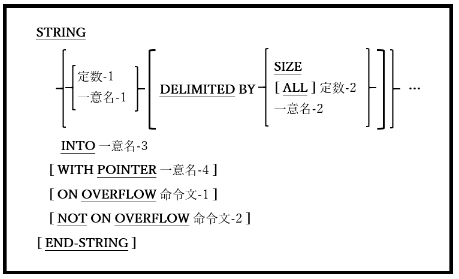

## 6.43. STRING

図6-98-STRING構文

STRING文は、複数の文字列のすべて、または一部を連結して新しい文字列を形成するために使われる。

1. 定数-1、定数-2、一意名-1、一意名-2、および一意名-3は、英数字のUSAGE DISPLAYデータとして明示的または暗黙的に定義しなければならない。これらの一意名はいずれも集団項目である可能性がある。

2. 一意名-4は、ゼロより大きい値を持ち、編集されていない基本整数値のデータ項目である必要がある。

3. 各定数-1 /一意名-1は送信項目と呼ばれ、一意名-3は受け取り項目と呼ばれる。

4. 各送信項目の内容は文字ごとに受け取り項目にコピーされる。最初の送信項目は、WITH POINTER句で指定された文字位置から始まる受け取り項目へコピーされる(文字位置には1から順に番号が振られる)。WITH POINTER句が指定されていない場合は、1が割り当てられる。2番目の送信項目は、最初の項目によって転送された最後の文字の次の文字位置から始まる受け取り項目へコピーされる。

5. 受け取り項目の最後の文字位置が入力されると、現在の送信項目にコピーすべきデータが残っているかどうか、または処理すべき送信項目が残っているかどうかに関係なく、STRING処理は終了する。

6. 送信項目にDELIMITED BY SIZEオプションが指定されている場合、送信項目の全体がコピーされる。DELIMITED BY句が指定されていない場合、DELIMITED BY SIZEが割り当てられる。

7. 送信項目にSIZEオプションのないDELIMITED BY句がある場合、一意名-2または**すべての** 定数-2で指定された文字順序が送信項目で見つかると、送信項目のコピーが終了する。

8. 受け取り項目(一意名-3)は、STRING文の開始時に(SPACESまたはその他の値に)初期化されることも、コピーされる送信項目の文字総数が受け取り項目のサイズよりも少ない場合にSPACEで埋められることもない。必要に応じて、STRINGを実行する前に受け取り項目を自分で明示的にINITIALIZE文(6.24)を使って初期化することができる。

9. 一意名-4の値が1未満の場合、またはすべての送信項目が完全に処理される前に受け取り項目の空白が不足している場合、オーバーフロー状態になる。このような場合にON OVERFLOW句が存在する時、命令文-1が実行される。

10. オーバーフロー条件がなく、NOT ON OVERFLOW句が存在する場合は、命令文-2が実行される。

11. STRING文が終了して命令文が実行されると、制御はSTRING文に続く次の文に移る。
