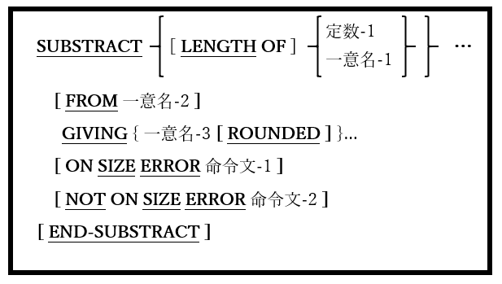

<!--navi start1-->
[前へ](6-44-1.md)/[目次](https://opensourcecobol.github.io/markdown/TOC.html)/[次へ](6-44-3.md)
<!--navi end1-->
### 6.44.2. SUBTRACT文の書き方2 ― SUBTRACT GIVING

図6-100-SUBSTRACT GIVING構文

FROM(一意名-1または定数-1)の前にあるすべての引数の算術合計を生成し、その合計を一意名-2の内容から減算し、GIVING(一意名-3)の後にリストされた一意名の内容をその結果に置き換える。

1. 一意名-1および一意名-2は、編集不可の数値データ項目でなければならない。

2. 一意名-3は数値データ項目でなければならないが、編集可能な場合もある。

3. 定数-1は数字定数でなければならない。

4. ROUNDED、ON SIZE ERRORおよびNOT ON SIZE ERROR句は、ADD文([6.5.1](6-5-1.md))の場合と同じように使われる。

<!--navi start2-->

[ページトップへ](6-44-2.md)
<!--navi end2-->
