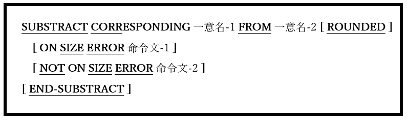

### 6.44.3. SUBTRACT文の書き方3 ― SUBTRACT CORRESPONDING

図6-101-SUBSTRACT CORRESPONDING構文

二つの一意名に従属して見つかったデータ項目の一致と対応すする、個々のSUBTRACT FROM文と同等のコードを生成する。

1. 対応する一致を識別するためのルールは、6.28.2 ― MOVE CORRESPONDINGで説明している。

2. ROUNDED、ON SIZE ERRORおよびNOT ON SIZE ERROR句は、ADD文 (6.5.1)の場合と同じように使われる。
