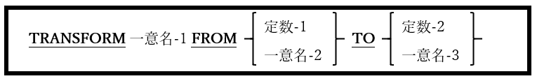
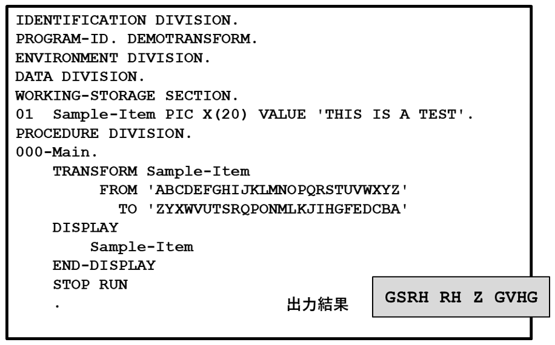

<!--navi start1-->
[前へ](6-46.md)/[目次](https://opensourcecobol.github.io/markdown/TOC.html)/[次へ](6-48.md)
<!--navi end1-->
## 6.47. TRANSFORM

図6-104-TRANSFORM構文

TRANSFORM文は、データ項目の一連の文字をスキャンして置換する。それは「TO」句の前後の引数によって定義される。

1. 「TO」句の前に指定された定数-1または一意名-2はターゲット文字列と呼ばれ、置き換える一意名-1の文字を定義する。

2. 「TO」句の後に指定された定数-2または一意名-3は置換文字列と呼ばれ、定数-1または一意名-2で指定された文字と置き換える一意名-1の文字を定義する。

3. TRANSFORM文は1985年のCOBOL標準で廃止され、その機能はINSPECT文、具体的にはCONVERTING句([6.26](6-26.md))に含まれている。

4. 一意名-1の内容が一文字ずつスキャンされる。その文字がターゲット文字列に含まれている場合、置換文字列内の(相対位置に)対応する文字が一意名-1の内容を置換する。

5. 置換文字列の長さがターゲット文字列の長さを超える場合、超過分は無視される。

6. ターゲット文字列の長さが置換文字列の長さを超える場合、長さの差を補うために置換文字列の右側に空白が埋め込まれていると見なされる。

    図6-105-機能的なTRANSFORM文

    

<!--navi start2-->

[ページトップへ](6-47.md)
<!--navi end2-->
