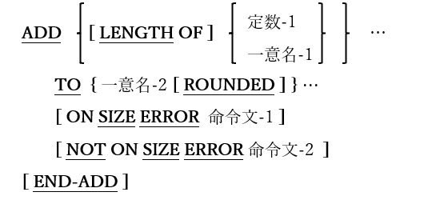
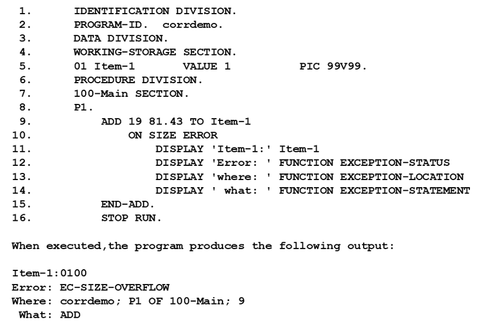

<!--navi start1-->
[前へ](6-4-7.md)/[目次](https://opensourcecobol.github.io/markdown/TOC.html)/[次へ](6-5-2.md)
<!--navi end1-->
## 6.5. ADD

### 6.5.1. ADD文の書き方1 ― ADD TO

図6-26-ADD TO構文

TOの<u>前</u>にあるすべての引数(一意名-1または定数-1)の算術和を生成し、その合計値をTOの<u>後</u>にリストされている各一意名(一意名-2)に追加する。

1. 一意名-1および一意名-2は、編集不可の数値データ項目でなければならない。

2. 定数-1は数字定数でなければならない。

3. 整数以外の結果が生成されるか、あるいはROUNDEDキーワードを持つ一意名-2データ項目に割り当てられた場合、一意名-2に格納された結果は、数学的規則に従って最下位桁を切り上げられる。例えば、PICTUREが99V99で、格納される結果が12.152の場合、値は12.15になるが、結果が76.165の場合では76.17の値が格納される。

4. LENGTH OF句が定数-1または一意名-1で使用されている場合、計算プロセスの中で使われる算術値は、データ項目または定数のバイト単位での長さであり、実際の値ではない。

5. ONSIZE ERROR句を使うと、一意名-2の項目に格納される結果がその項目の容量を超えた場合に実行されるコードを指定することができる。例えば、PICTUREが99V99で、格納される結果が101.43の場合、SIZE ERROR条件が発生する。ON SIZE ERROR句がない場合、opensource COBOLは01.43の値を項目に格納する。ON SIZE ERROR句を使用すると、一意名-2項目の値は変更されずに、命令文-1が実行される。例として、デモプログラムとその出力を示した(図6-27)。<!--また、「EXCEPTION」組み込み関数についても説明している([6.1.7](6-1-7.md)参照)。-->

    図6-27-ON SIZE ERROR句を使用するサンプルプログラム

    

6. NOT ON SIZE ERROR句を指定すると、ADD文で項目サイズのオーバーフロー条件が発生しなかった場合に命令文が実行される。

<!--navi start2-->

[ページトップへ](6-5-1.md)
<!--navi end2-->
