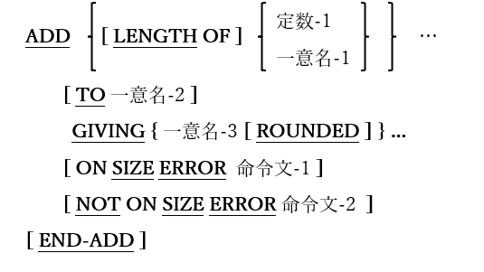

### 6.5.2. ADD文の書き方2 ― ADD GIVING

図6-28-ADD GIVING構文

TOの<u>前</u>にあるすべての引数(一意名-1または定数-1)の算術和を生成し、一意名-2(存在する場合)に合計値を追加、GIVINGの<u>後</u>にリストされている一意名(一意名-3)の内容を合計値に置き換える。

1. 一意名-1および一意名-2は、編集不可の数値データ項目でなければならない。

2. 一意名-3は数値データ項目でなければならないが、編集可能な場合もある。

3. 定数-1は数字定数でなければならない。

4. 一意名-2の内容は変更できない。

5. ROUNDED、LENGTH OF、ON SIZEERRORおよびNOTON SIZE ERROR句の使い方と動作は、6.5.1 ADD文の書き方1で説明している。
