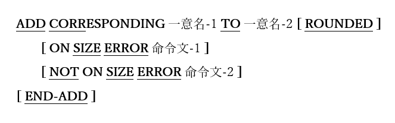

<!--navi start1-->
[前へ](6-5-2.md)/[目次](https://opensourcecobol.github.io/markdown/TOC.html)/[次へ](6-6.md)
<!--navi end1-->
### 6.5.3. ADD文の書き方3 ― ADD CORRESPONDING

図6-29-ADD CORRESPONDING構文

二つの一意名に従属して見つかったデータ項目に対応する個々のADD TO文と、同等のコードを生成する。

1. 対応するものを識別するための規則については、[6.28.2](6-28-2.md) – MOVE CORRESPONDINGで説明している。

2. ROUNDED、ON SIZEERRORおよびNOT ON SIZE ERROR句の使い方と動作は、[6.5.1](6-5-1.md) ADD文の書き方1で説明している。

<!--navi start2-->

[ページトップへ](6-5-3.md)
<!--navi end2-->
