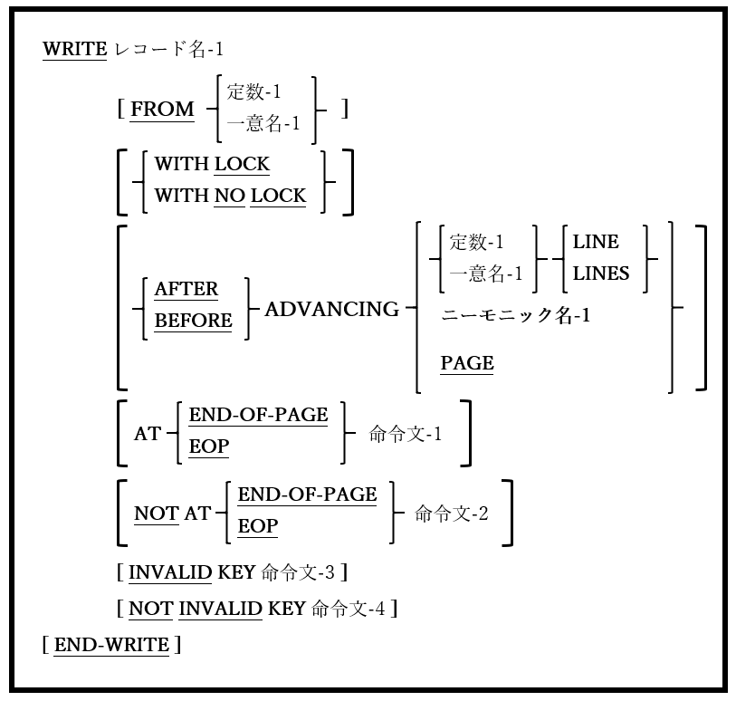

<!--navi start1-->
[前へ](6-49.md)/[目次](https://opensourcecobol.github.io/markdown/TOC.html)/[次へ](7-1.md)
<!--navi end1-->
## 6.50. WRITE

図6-109-WRITE構文

WRITE文は、OPENファイルに新しいレコードを書き込む。

1. レコード名-1は、OUTPUT、I-OまたはEXTENDに対して、現在もOPEN([6.31](6-31.md))状態であるファイルの、ファイル記述(FD－[5.1](5-1.md)を参照)に従属する01レベルのレコードとして定義する必要がある。

2. 定数-1または一意名-1は、英数字のUSAGE DISPLAYデータとして明示的または暗黙的に定義する必要がある。一意名-1は集団項目の場合がある。

3. オプションのFROM句を使用すると、レコード名-1をファイルに書き込む前に、定数-1または一意名-1が暗黙的にレコード名-1にMOVEする。

4. レコードのLOCKオプションについては[6.1.8.2](6-1-8-2.md)で説明している。

5. ADVANCING句は、レポートが書き込まれるORGANIZATION LINE SEQUENTIALファイルで使われることを目的としている。この句を他のORGANIZATIONで使用すると、コンパイラによって完全に拒否されるか(ORGANIZATION IS RELATIVEまたはORGANIZATION IS INDEXED)、ファイルに不要な文字が書き込まれる可能性がある(ORGANIZATION IS RECORD BINARY SEQUENTIAL)。

6. ADVANCING n LINES句は、書き込まれたレコードの前(AFTER ADVANCING)または書き込まれたレコードの後(BEFORE ADVANCING)のいずれかに、指定された数の改行(X"10")文字をファイルに導入する。

7. ORGANIZATION LINE SEQUENTIALファイルへのWRITE文でADVANCING句が指定されていない場合、AFTER ADVENCING 1 LINEが指定されたとみなす。

8. ADVANCING PAGE句は、書き込まれたレコードの前(AFTER ADVANCING)または書き込まれたレコードの後(BEFORE ADVANCING)のいずれかに、改ページ(X"0C")文字をファイルに導入する。

9. 書き込まれるファイルのFDにLINAGE句([5.1](5-1.md#51-ファイル記述))が含まれている場合、内部のラインカウンターはランタイムライブラリによって維持され、LINAGE定義のLINES AT TOPおよび/またはLINES AT BOTTOM指定に対応するかたちで、適切な数のASCII改行文字がファイルに自動的に書き込まれる。

10. AT END-OF-PAGE句とNOT AT END-OF-PAGE句は、ファイル記述にLINAGE句が含まれているORGANIZATION LINE SEQUENTIALまたはORGANIZATION RECORD BINARY SEQUENTIALファイルに対してのみ有効である([5.1](5-1.md))。

11. WRITE処理中にページ終了条件が発生した場合、AT END-OF-PAGE句がトリガーされる(したがって命令文-1が実行される)。ページ終了条件は、WRITE文がデータ行または改行文字をファイルのページフッター領域内の行位置に導入したときに発生する([図5-3](5-1.md#5-3.png)を参照)。

12. WRITE処理中にページ終了条件が発生しなかった場合、NOT AT END-OF-PAGE句がトリガーされる(したがって命令文-2が実行される)。

13. 目的とする結果を得るには、ADVANCING句とAT END-OF-PAGE句の組合せの動作を理解する必要がある。そのために、これらの句を含むWRITE文で発生する一連のイベントを次に示す：

    a. AFTER ADVANCINGが指定されている場合：

    - AFTER ADVANCING PAGEが指定された場合、改ページ文字がファイルに書き込まれ、内部のページ終了スイッチが設定される。

    - それ以外の場合は、適切な数の改行文字(ADVANCING n LINES)がファイルに書き込まれる。内部のLINAGEカウンターが、改行によって論理ページの最大使用可能行数が使い果たされたことを示している場合、内部のページ終了スイッチが設定される。

    b. データレコードがファイルに書き込まれる。内部のLINAGEカウンターが、レコードの書き込みによって論理ページの最大使用可能行数が使い果たされたことを示している場合、内部のページ終了スイッチが設定される。

    c. BEFORE ADVANCINGが指定されている場合：
		
    - BEFORE ADVANCING PAGEが指定された場合、改ページ文字がファイルに書き込まれ、内部のページ終了スイッチが設定される。

    - それ以外の場合は、適切な数の改行文字(ADVANCING n LINES)がファイルに書き込まれる。内部のLINAGEカウンターが、改行によって論理ページの最大使用可能行数が使い果たされたことを示している場合、内部のページ終了スイッチが設定される。

    d. 内部のページ終了スイッチが設定されていない場合、命令文-2(存在する場合)が実行される。

    - それ以外の場合(内部のページ終了スイッチが設定されている場合)、命令文-1(存在する場合)が実行される。

14. 上記13項を基に、AT END-OF-PAGE句でページ見出しを自動生成できるサンプルコードは以下のようになる。

        FD Report-File
           LINAGE IS 66 LINES
        ........WITH FOOTER AT 57
        ........LINES AT TOP 3
        ........LINES AT BOTTOM 3
        .
        .
        .
        OPEN OUTPUT Report-File
        PERFORM Generate-Page-Header
        .
        .
        .
        WRITE Report-Rec AFTER ADVANCING 1 LINE
            AT END-OF-PAGE PERFORM Generate-Page-Header
        END-WRITE
        .
        .
        .
        CLOSE Report-File

15. INVALIDKEY句とNOT INVALID KEY句は、ORGANIZATION RELATIVEまたはORGANIZATION INDEXEDファイルで使われるWRITE文でのみ有効である。

16. 書き込み中にエラーが発生した場合、ON INVALID KEY句がトリガーされる(したがって命令文-3が実行される)。この場合、入出力エラーまたは「キーが既に存在している」エラー(ファイルステータス22)である可能性があり、既に存在するレコードを書き込もうとしたことを示している。

17. 書き込み中にエラーが発生しなかった場合、NOT ON INVALID KEY句がトリガーされる(したがって命令文-4が実行される)。

<!--navi start2-->

[ページトップへ](6-50.md)
<!--navi end2-->
