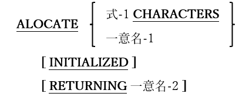

## 6.6. ALLOCATE

図6-30-ALLOCATE構文

ALLOCATE文は、実行時に動的にメモリを割り当てるために使用する。

1. 式-1を使う場合、ゼロ以外の正の整数値を持つ算術式である必要がある。「式-1 CHARACTERS」オプションを使う時は、06FEB2009バージョンの構文パーサーを混乱させないように式を括弧で囲んで、「一意名-1」オプションと間違えないように気を付ける。パーサーが「混乱」する可能性については、今後、opensource COBOL 1.1 tarballで修正される予定である。

2. 一意名-1は、WORKING-STORAGEまたはLOCAL STORAGEのBASED属性で定義された01レベル項目である必要がある。連絡節で定義されている01項目にすることもできるが推奨しない。

3. 一意名-2はUSAGE POINTERデータ項目である必要がある。

4. RETURNING句は、割り当てられたメモリブロックのアドレスを、指定されたUSAGE POINTER項目に返す。そのUSAGE POINTER項目に対してFREE文(6.19)が発生した場合に備え、opensource COBOLは割り当てられたメモリブロックが最初に要求されたサイズの情報を保持している。

5. 「一意名-1」オプションを使うと、INITIALIZEは一意名-1の定義に存在するPICTURE句およびVALUE句(存在する場合)に従って、割り当てられたメモリブロックを初期化する。INITIALIZE文については、6.24で説明している。
6. 「式-1CHARACTERS」オプションでは、INITIALIZEは割り当てられたメモリブロックをバイナリゼロに初期化する。

7. INITIALIZE句を使わない場合、割り当てられたメモリの初期内容は、プログラムが実行されているオペレーティングシステムに対して有効なメモリ割り当てのルールに委ねられる。

8. 基本的な使用法は二つあり、最も単純なものは次の例である。

            ALLOCATE My-01-Item
    
    **My-01-Item** の定義済みサイズ(BASED属性で定義されている必要がある)と同じサイズのストレージブロックが割り当てられる。この時ストレージブロックのアドレスが**My-01-Item** の基本アドレスとなり、そのブロックと下位データ項目がプログラム内で使用できるようになる。
    
    二つ目の使用法は以下の通りである。
    
            ALLOCATE LENGTH OF My-01-Item CHARACTERS RETURNING The-Pointer.
    
            SET ADDRESS OF My-01-Item TO The-Pointer.
    
    ALLOCATE文は、**My-01-Item** に必要な分と全く同じサイズのメモリブロックを割り当て、アドレスはポインタ変数に返される。次にSET分は、**My 01-Item** のアドレスを「ベース」として、ALLOCATEによって作成されたメモリブロックのアドレスにする。
    
    上記二つの使用法の唯一の機能上の違いとしては、最初の例で、INITIALIZED句がある場合は尊重されることである。

9. ストレージが割り当てられる前、またはストレージが解放された後にBASEDデータ項目を参照すると、予測できない結果が発生する`19`。

---
`19` COBOL標準では、「unpredictable results - 予測不可能な結果」という用語で、予期しないまたは望ましくない動作を示し、プログラムは無効なアドレスへのアクセスを中止する可能性がある。
