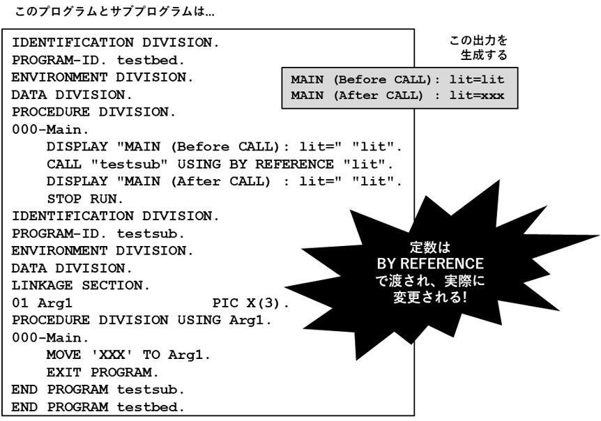
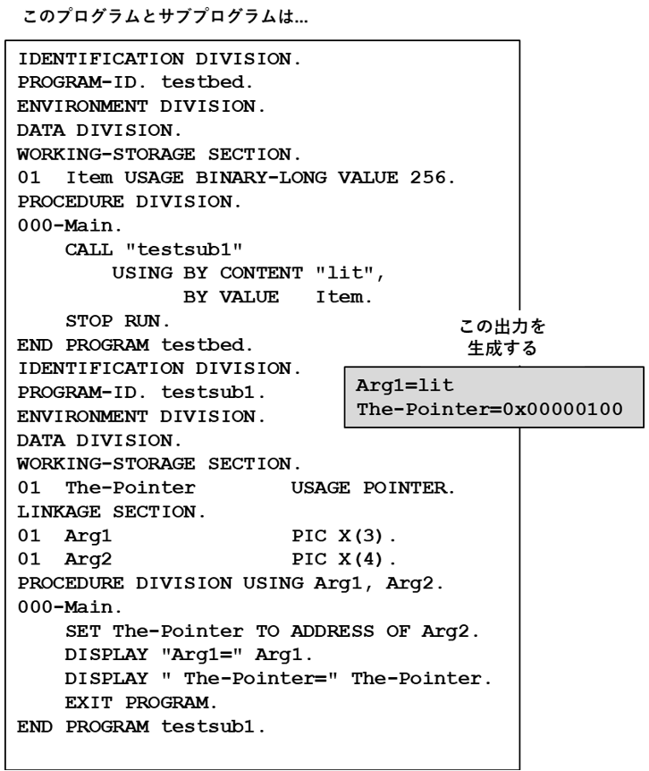

## 6.7. CALL

図6-31-CALL構文

CALL文は、サブプログラムまたはサブルーチンと呼ばれる別のプログラムに制御を移行するために使われる。

1. サブプログラムは最終的に制御をCALLする側のプログラムに戻し、CALL文の直後の文から実行を再開することが期待される。ただし、サブプログラムはCALLする側のプログラムに戻る必要はなく、必要に応じてプログラムの実行を自由に停止することができる。

2. EXCEPTIONキーワードとOVERFLOWキーワードは同意義のものとして扱うことができる。

3. RETURNINGキーワードとGIVINGキーワードは同意義のものとして扱うことができる。

4. 定数-1またはindetifier-1の値は、呼び出しをするサブプログラムの記述項ポイントである。この記述項ポイントの使用方法の詳細については、7.1.4および7.1.5で説明する。

5. 一意名-1を使ってサブルーチンを呼び出すと、ランタイムシステムに、動的にロード可能なモジュールを呼び出すよう強制される。このモジュールについては、7.1.4で説明する。

6. ON EXCEPTION句では、動的にロード可能なモジュールのロードが失敗した場合に実行されるコードを指定する。 ON EXCEPTIONを指定すると、エラーメッセージを生成してプログラムを停止する、という初期動作が上書きされ、指定したロジックへと置き換えられる。

7. NOT ON EXCEPTION句では、動的にロード可能なモジュールのロードが成功した場合に実行されるコードを指定する。

8. USING句では、CALLする側のプログラムからサブプログラムに渡される可能性のある引数のリストを定義する。引数が渡される方法は、BY句によって異なる。

9. CALLされるサブプログラムがopensource COBOLプログラムであり、そのプログラムのPROGRAM-ID句にINITIAL属性が指定されている場合、サブプログラムが実行されるたびに、データ部の全てのデータが初期状態に復元される`20`。この[再]初期化動作は、INITIALの使用(または不使用)に関係なく、サブプログラムのLOCAL-STORAGE SECTION(存在する場合)で定義されたすべてのデータに適用される。

10. BY REFERENCE句(既定値)は引数のアドレスをサブプログラムに渡し、サブプログラムがその引数の値を変更できるようにする。引数として渡されるのが定数値であるとき、これは危険な行為となる場合がある。

11. BY CONTENTは、引数のコピーのアドレスをサブプログラムに渡す。サブプログラムが引数の値を変更した場合、CALLする側のプログラムに戻された元のバージョンは変更されない。図6-32に示すように、これは定数値をサブプログラムに渡すための最も安全な方法である。

    図6-32-CALL BY REFERENCE句(望ましくない影響を及ぼす場合がある)

    

12. BY VALUEは、引数のアドレスを引数として渡す。図6-33にコーディング例を示したが、サブプログラムがopensource COBOLで記述されている場合は、おそらくこのコーディングは不要である。なぜならこの機能は、C、C ++およびその他の言語との互換性を持たせるために存在するからである。

    図6-33 CALL BY VALUE句

    

13. RETURNING句では、サブルーチンが値を返すデータ項目を指定することができる。CALLでこの句を使う場合、サブルーチンの手続き部のヘッダーにRETURNING句を含める必要がある。もちろんサブルーチンは、BY REFERENCEによって渡された任意の引数に値を返すことができる。

14. その他詳細については6.8(CANCEL)、6.16(ENTRY)、6.18(EXIT)、および6.21(GOBACK)で説明する。

---
`20` サブプログラム内のどのエントリポイントがCALLされるかは関係しない。
