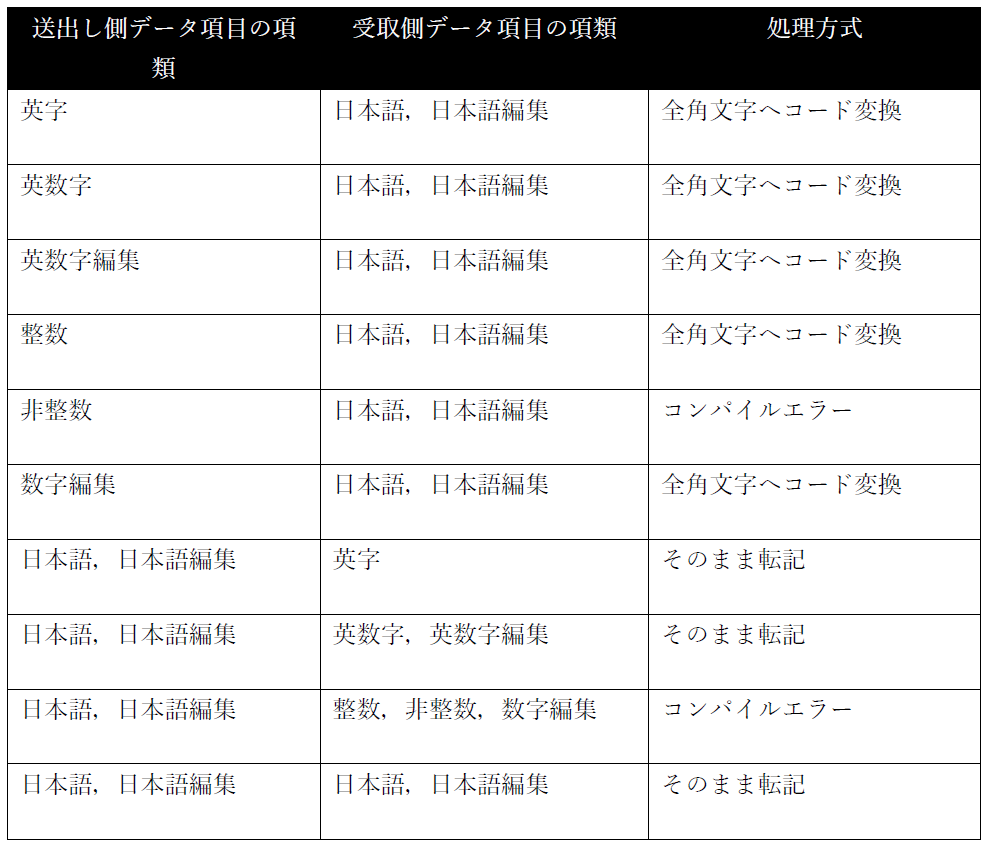
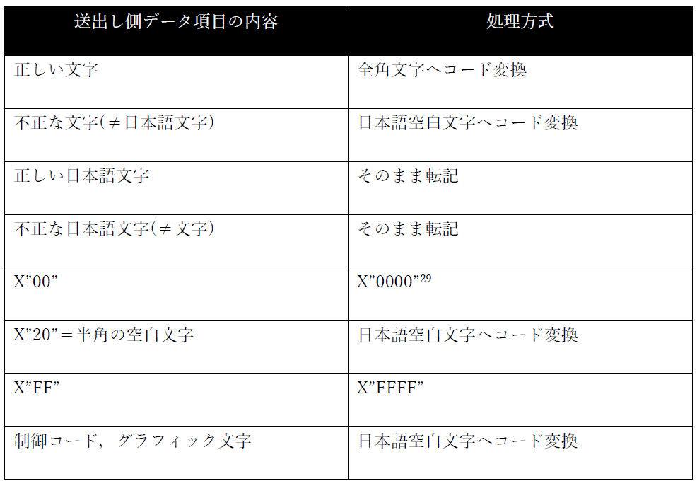

## 7.3. 各命令文と日本語の取扱い

### 7.3.1. MOVE文

MOVE文で、英字、英数字、整数、英数字編集及び数字編集項目と日本語項目との転記を認めている。このことは、INSPECT文、STRING文及びUNSTRING文で、日本語文字(全角文字)と文字(半角文字)との混在を禁止しているので、文法上の整合はとれないが、PIC X項目による日本語の定義と格納と同様、実アプリケーション上の必要性があるということで転記を認めている。

表7-2は、転記時の処理内容を示すものであるが、送出し側データ項目には、文法上規定された正しいデータが格納されているものとする。

表7-2-転記の処理方法

データの内容は、文字データのみ、日本語文字データのみ、および文字と日本語データが混在している場合がある。

文字には半角カタカナも含まれる。

ここで、文法上定義されていないのは、英字、英数字、英数字編集データ項目の内容が、日本語文字のみ、または文字と日本語文字が混在している時の処理方法である。この場合、送出し側データ項目の内容がすべて日本語文字(全角文字)の場合は、そのまま転記する。日本語文字(全角文字)と文字(半角文字)が混在しているときは、文字は全角文字へ変換を行い、日本語文字はそのまま転記する。なお、集団項目は英数字項目の扱いになるため、受取り側の各基本項目が日本語項目であっても、全角文字へのコード変換は行われない。転記は、標準桁寄せ規則に従って、必要に応じて右端を切り捨てたり、日本語空白文字の空白詰めを行う。ただし、送出し側が日本語データ項目で、受取り側データ項目の英字、英数字、英数字編集項目が２バイト単位のデータを格納できない(最後の１バイト領域へ全角文字を転記)場合には、最右端の最後のバイトは空白文字に置き換えられる。受取り側データ項目にJUSTIFIED句（けたよせ）句を書いた場合、桁寄せは、5.3に示すJUSTIFIED RIGHT句の規則に従う。

受取り側データ項目が日本語、日本語編集のとき、送出し側データ項目の内容によっては、次のように転記される。

表7-3-送出し側データ項目の内容に対する処理方法

ただし、日本語空白文字は、シフトJISコード系ではX”8140”である。

---
`29` opensource COBOL 1.5.2Jではそのまま転記される不具合が発生している。
