## 8.3. 組み込みサブルーチン

### 8.3.1. 「名前による呼び出し」ルーチン

opensource COBOLには多数の組み込みサブルーチンが含まれており、一般的にMicro Focus COBOL(CBL_...)またはACUCOBOL(C$ ...)で使用可能なルーチンと一致することを目的としている。

これらのルーチンはすべて大文字表記で実行され、次の機能を実行することができる。


- 現在のディレクトリの変更
- ファイルのコピー
- ディレクトリの作成
- ファイルの作成、開く、閉じる、読み取り、書き込み
- ディレクトリ(フォルダ)の削除
- ファイルの削除
- サブルーチンに渡された引数の数の決定
- ファイル情報の取得(サイズと最終変更日時)
- サブルーチンに渡される引数の長さ(バイト単位)の取得
- 項目の左揃え、右揃え、または中央揃えの決定
- ファイルの移動(破壊的な「コピー」)
- スリープ時間を秒単位で指定して、プログラムを「スリープ状態」にする
- スリープ時間をナノ秒単位で指定して、プログラムを「スリープ状態」にする

    警告：時間をナノ秒で表すが、Windowsシステムはミリ秒単位でしかスリープできない
- 実行時のopensource COBOLのバージョンに適したシェル環境にコマンドを送信する

次の表では様々な組み込みサブルーチンについて説明する。明示的に記載されている場合を除き、すべてのサブルーチン引数は必須である。値をRETURN-CODEに返すサブルーチンは、CALL文のRETURNING / GIVING句を利用して、選択したフルワードのバイナリCOMP-5データ項目に結果を返すことができる。これについて6.7で説明している。

#### 8.3.1.1. CALL “C$CALLEDBY” USING *program-name GIVING status*

このルーチンは、実行中のCOBOLプログラムを呼出したプログラム名を返す。呼出しプログラムが存在しないか未知の場合には、空白を戻す。

*program-name*には呼出しプログラム名か、呼出しプログラムが存在しないか未知の場合には空白を含む。呼出されたプログラムがオブジェクトライブラリにあると、プログラムはPROGRAM-IDを戻す。オブジェクトライブラリにもないと、ディスク名が戻される。

statusは次のいずれかの値を受け取る。

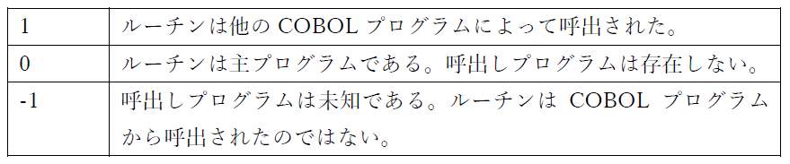

#### 8.3.1.2. CALL “C$CHDIR” USING *directory-path, result*

このルーチンは、*directory-path* (英数字定数または一意名) を現在のディレクトリにする。

操作の戻り値は、*result*引数 (編集されていない数値一意名) と RETURN-CODE 特殊レジスタの両方で返される。操作の戻り値は、0=成功または128=失敗のいずれかである。

ディレクトリの変更は、プログラムが終了するまで (プログラムが再起動された場合は現在のディレクトリが自動的に復元される)、または別の C$CHDIR が実行されるまで有効である。

[8.3.1.15章](8-3-1.md#83115-call-cbl_change_dir-using-directory-path)―**CBL_CHANGE_DIR**を参照

#### 8.3.1.3. CALL “C$COPY” USING src-file-path, dest-file-path, 0

このサブルーチンは、「CP」 (Unix) または 「COPY」 (Windows) コマンドを介して行われたかのように、*src-file-path* を *dest-file-path*にファイルをコピーする。

どちらのファイルパス引数も、英数字定数または一意名にすることができる。

第3引数は必須ではあるが、使用されない。

ファイルのコピーに失敗した場合 (例えば、ファイルまたは宛先ディレクトリが存在しない場合)、RETURN-CODE は 128 に設定され、正常に完了すると0 に設定される。

[8.3.1.18章](8-3-1.md#83118-call-cbl_copy_file-using-src-file-path-dest-file-path)―**CBL_COPY_FILE** を参照

#### 8.3.1.4. CALL “C$DELETE” USING *file-path*, 0

このルーチンは、「RM」(Unix) または「ERASE」(Windows) コマンドを使用して行われたかのように、file-path引数 (英数字定数または一意名) で指定されたファイルを削除する。

第2 引数は必須ではあるが、使用されない。

ファイルの削除に失敗した場合 (例えば、ファイルが存在しない場合)、RETURN-CODE は 128 に設定され、正常に完了すると0 に設定される。

[8.3.1.22章](8-3-1.md#83122-call-cbl_delete_file-using-file-path)―**CBL_DELETE_FILE**を参照

#### 8.3.1.5. CALL “C$FILEINFO” USING *file-path, file-info*

このルーチンを使用すると、*file-path*引数 (英数字定数または一意名) として指定されたファイルサイズ`38`と、ファイルが最後に変更された日付/時刻を取得できる。この情報は、次の 16 バイト領域として定義される *file-info* 引数に返される。

    01 File-Info. 
       05 File-Size-In-Bytes   PIC 9(18) COMP.  
       05 Mod-YYYYMMDD         PIC 9(8)  COMP. *> Modification Date 
       05 Mod-HHMMSS00         PIC 9(8)  COMP. *> Modification Time

変更時刻の小数点以下 2 桁は常に 0 である。

サブルーチンが成功すると、RETURN-CODEには0の値が返され、ファイルで必要な統計を取得できないと、RETURN-CODEには35の値が返される。2 つ未満の引数を指定すると、RETURN-CODEには128の値が生成される。

[8.3.1.16章](8-3-1.md#83116-call-cbl_check_file_exist-using-file-path-file-info)―**CBL_CHECK_FILE_EXIST** を参照

#### 8.3.1.6. CALL “C$JUSTIFY” USING data-item, “justification-type”

C$JUSTIFY を使用して、英字、英数字、または数字の編集されたデータ項目を左、右、または中央揃えにする。*justification-type* 引数は、実行する位置揃えのタイプを示す。その引数の値は次のように解釈される。

    なし        「R」と同じように扱われる  
    Cxxx...     大文字の「C」で始まる場合、値は中央揃えになる  
    Rxxx...     大文字の「R」で始まる場合、値は右揃えとなり、左に空白が埋められる  
    Lxxx...     大文字の「L」で始まる場合、値は左揃えとなり、右に空白が埋められる  
    それ以外     「R」として扱われる

#### 8.3.1.7. CALL “C$LIST-DIRECTORY” USING *item-1, item-2, item-3*

このルーチンは、選択されたディレクトリの内容をリストする。各オペレーティングシステムには、このタスクを果たす独特の方法がある。C$LIST-DIRECTORYは、すべてのオペレーティングシステムのために機能する一つの方法を提供する。

与えられたディレクトリにあるファイルの名前を取得することを可能にする。3つの明白な操作によってこれを成し遂げる。最初の操作は指定されたディレクトリを開き、そして、ファイルのリストを作成する。第2の操作で1つずつリストにあるファイル名を返し、第3の操作でディレクトリを閉じ、ルーチンによって使われた全てのメモリを解放する。

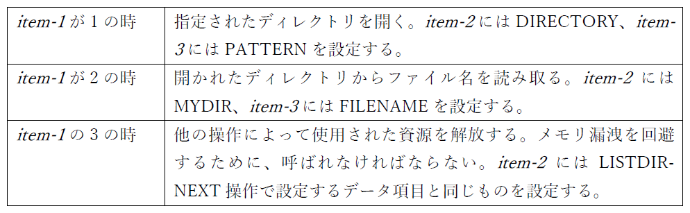

```
    01 PATTERN      PIC X(5) VALUE "*".
    01 DIRECTORY    PIC X(256) VALUE
    "./list".
    01 FILENAME     PIC X(30).
    01 MYDIR        PIC 9(8) COMP-5.
    PROCEDURE      DIVISION.
        CALL "C$LIST-DIRECTORY" USING 1,
                                      DIRECTORY,
                                      PATTERN
        END-CALL.
        MOVE RETURN-CODE TO MYDIR.
        CALL "C$LIST-DIRECTORY" USING 2,
                                      MYDIR,
                                      FILENAME
        END-CALL.
        PERFORM WITH TEST AFTER UNTIL FILENAME = SPACES
          DISPLAY FUNCTION TRIM(FILENAME)
          CALL "C$LIST-DIRECTORY" USING 2,
                                        MYDIR,
                                        FILENAME
          END-CALL
        END-PERFORM.
        CALL "C$LIST-DIRECTORY" USING 3, MYDIR
        END-CALL.
```

#### 8.3.1.8. CALL “C$MAKEDIR” USING *dir-path*

このルーチンを使用すると新しいディレクトリを作成でき、ディレクトリ名は、*dir-path* 引数 (英数字定数または一意名) として指定される。

指定されたパスの最下層 (最後) のディレクトリのみを作成でき、他のディレクトリは既に存在していなければならない。このサブルーチンは、「mkdir –p」(Unix) または「mkdir /p」(Windows) としては動作しない。

RETURN-CODE は操作の戻り値に設定され、0=成功または128=失敗のいずれかである。

[8.3.1.19章](8-3-1.md#83119-call-cbl_create_dir-using-dir-path)―**CBL_CREATE_DIR** を参照

#### 8.3.1.9. CALL “C$NARG” USING *arg-count-result*

C$NARG を呼び出すサブルーチンに渡された引数の数を数値項目 *arg count-result* に返す。

メインプログラムからCALLされた場合、戻り値は常に 0 になる。

[6.1.7章](6-1-7.md)―**NUMBER-OF-CALL-PARAMETERS** を参照

#### 8.3.1.10. CALL “C$PARAMSIZE” USING *argument-number*

このサブルーチンは、argument-numberパラメータ(数字定数またはデータ項目) を使用して指定されたサブルーチン引数のサイズ (バイト単位) を返す。

サイズは、RETURN-CODE 特殊レジスタに返される。

指定された引数が存在しない場合、または無効なargument-numberが指定された場合、値には0 が返される。

#### 8.3.1.11. CALL “C$SLEEP” USING *seconds-to-sleep*

C$SLEEP は、指定された秒数だけプログラムをスリープ状態にする。seconds-to-sleep 引数は、数字定数またはデータ項目である。

1 未満のスリープ時間は 0 として解釈され、スリープ遅延なしですぐに戻る。

[8.3.1.33章](8-3-1.md#83133-call-cbl_oc_nanosleep-using-nanoseconds-to-sleep)―**CBL_OC_NANOSLEEP**を参照

#### 8.3.1.12. CALL “C$TOLOWER” USING *data-item*, BY VALUE *convert-length*

このルーチンは、*convert-length* (数字定数またはデータ項目) の *data-item* (英数字一意名) の先頭文字を小文字に変換する。

*convert-length* 引数は、**BY VALUE** で指定する必要がある。*data-item* の (先頭) 文字がいくつ変換されるかを指定し、それ以降の文字は変更されない。

*convert-length* が負またはゼロの場合、変換は実行されない。

[8.3.1.38章](8-3-1.md#83138-call-cbl_tolower-using-data-item-by-value-convert-length)―**CBL_TOLOWER**を参照

#### 8.3.1.13. CALL “C$TOUPPER” USING *data-item*, BY VALUE *convert-length*

C$TOUPPER サブルーチンは、*convert-length* (数字定数またはデータ項目) の *data-item* (英数字一意名) の先頭文字を大文字に変換する。

*convert-length* 引数は、**BY VALUE** で指定する必要がある。*data-item* の (先頭) 文字がいくつ変換されるかを指定し、それ以降の文字は変更されない。

*convert-length* が負またはゼロの場合、変換は実行されない。

[8.3.1.39章](8-3-1.md#83139-call-cbl_toupper-using-data-item-by-value-convert-length)―**CBL_TOUPPER**を参照

#### 8.3.1.14. CALL “CBL_AND” USING *item-1, item-2*, BY VALUE *byte-length*

このサブルーチンは、ビット単位のAND演算を項目-1 と項目-2 の左端の 8* *byte-length*の位置同士のビットで実行し、結果のビット文字列を項目-2 に格納する。

項目-1 は英数字定数またはデータ項目で、項目-2 はデータ項目である必要がある。項目-1 と 項目-2 の長さは、少なくとも 8* *byte-length* でなければならない。

*byte-length*は数字定数またはデータ項目であり、**BY VALUE**で指定する必要がある。

下の真理値表は「AND」プロセスを示している。

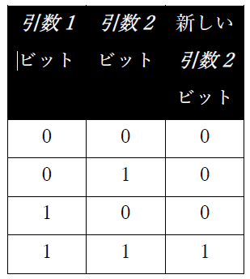

項目-2 の 8*\*byte-length* ポイントの後のビットは影響を受けない。

結果のゼロが RETURN-CODE レジスタに戻される。

#### 8.3.1.15. CALL “CBL_CHANGE_DIR” USING *directory-path*

このルーチンは、*directory-path* (英数字定数または一意名) を現在のディレクトリにする。

ディレクトリの変更は、プログラムが終了するまで (プログラムが再起動された場合は現在のディレクトリが自動的に復元される)、または別のCBL_CHANGE_DIR (または C$CHDIR) が実行されるまで有効である。

操作の戻り値は、RETURN-CODE 特殊レジスタに返され、0=成功または128=失敗のいずれかである。

[8.3.1.2章](8-3-1.md#8312-call-cchdir-using-directory-path-result)―**C$CHDIR**を参照

#### 8.3.1.16. CALL “CBL_CHECK_FILE_EXIST” USING *file-path, file-info*

このルーチンは、*file-path*引数(英数字定数または一意名)として指定されたファイルサイズ`39`と、ファイルが最後に変更された日付/時刻を取得できる。この情報は、次の16バイト領域として定義される*file-info*引数に返される。

    01 Argument-2.
        05 File-Size-In-Bytes       PIC 9(18) COMP.
        05 Mod-DD                   PIC 9(2) COMP.       *> Modification Time
        05 Mod-MO                   PIC 9(2) COMP.
        05 Mod-YYYY                 PIC 9(4) COMP.       *> Modification Date
        05 Mod-HH                   PIC 9(2) COMP.
        05 Mod-MM                   PIC 9(2) COMP.
        05 Mod-SS                   PIC 9(2) COMP.
        05 FILLER                   PIC 9(2) COMP.       *> This will always be 00

サブルーチンが成功すると、RETURN-CODEには0の値が返され、ファイルで必要な統計を取得できないと、RETURN-CODEには35の値が返される。2 つ未満の引数を指定すると、RETURN-CODEには128の値が生成される。

[8.3.1.5章](8-3-1.md#8315-call-cfileinfo-using-file-path-file-info)―**C$FILEINFO**を参照

#### 8.3.1.17. CALL “CBL_CHANGE_DIR” USING *directory-path*

CBL_CLOSE_FILE サブルーチンは、**CBL_OPEN_FILE** または **CBL_CREATE_FILE** サブルーチンによって既に開かれているファイルを閉じる。

*file-handle*引数 (PIC X(4) USAGE COMP-X データ項目) によって定義されたファイルが出力用に開かれた場合、ファイルが閉じられる前に **CBL_FLUSH_FILE** が暗黙的に実行される。

サブルーチンが成功するとRETURN-CODEには0の値が返され、失敗すると-1の値が返される。

#### 8.3.1.18. CALL “CBL_COPY_FILE” USING *src-file-path, dest-file-path*

このサブルーチンは、「CP」 (Unix) または 「COPY」 (Windows) コマンドを介して行われたかのように、*src-file-path*を*dest-file-path*にファイルをコピーする。

どちらのファイルパス引数も、英数字定数または一意名にすることができる。

ファイルのコピーに失敗した場合 (例えば、ファイルまたは宛先ディレクトリが存在しない場合)、RETURN-CODE は 128 に設定され、正常に完了すると0 に設定される。

[8.3.1.3章](8-3-1.md#8313-call-ccopy-using-src-file-path-dest-file-path-0)―**C$COPY**を参照

#### 8.3.1.19. CALL “CBL_CREATE_DIR” USING *dir-path*

このルーチンを使用すると新しいディレクトリを作成でき、ディレクトリ名は、*dir-path* 引数 (英数字定数または一意名) として指定される。

指定されたパスの最下層 (最後) のディレクトリのみを作成でき、他のディレクトリは既に存在していなければならない。このサブルーチンは、「mkdir –p」(Unix) または「mkdir /p」(Windows) としては動作しない。

RETURN-CODE は操作の戻り値に設定され、0=成功または128=失敗のいずれかである。

[8.3.1.8章](8-3-1.md#8318-call-cmakedir-using-dir-path)―**C$MAKEDIR**を参照

#### 8.3.1.20. CALL “CBL_CREATE_FILE” USING *file-path*, 2, 0, 0, *file-handle*

CBL_CREATE_FILE サブルーチンは、*file-path* 引数を使用して指定された新しいファイルを作成し、**CBL_WRITE_FILE** で使用できるファイルとして出力用に開く。

引数 2、3、および 4 は、示されている定数値としてコーディングする必要がある。`40`

後続の **CBL_WRITE_FILE** または **CBL_CLOSE_FILE** 呼び出しに対して、*file handle*(PIC X(4) USAGE COMP-X) が返される。

サブルーチンの成功または失敗はRETURN-CODE レジスタに報告され、RETURN-CODEで-1の値は無効な引数、0の値は成功を示す。

[8.3.1.34章](8-3-1.md#83134-call-cbl_open_file-file-path-access-mode-0-0-handle)―**CBL_OPEN_FILE**を参照

#### 8.3.1.21. CALL “CBL_DELETE_DIR” USING *dir-path*

CBL_DELETE_DIRを使って空のディレクトリを削除する。

唯一の引数―dir-path (英数字定数または一意名) ―は、削除するディレクトリ名である。

指定したパスの最下層レベル (最後) のディレクトリのみが削除され、そのディレクトリは空でなければならない。

RETURN-CODE は操作の戻り値に設定され、0=成功または128=失敗のいずれかである。

#### 8.3.1.22. CALL “CBL_DELETE_FILE” USING *file-path*

このルーチンは、「RM」(Unix) または「ERASE」(Windows) コマンドを使用して行われたかのように、file-path引数 (英数字定数または一意名) で指定されたファイルを削除する。

ファイルの削除に失敗した場合 (例えば、ファイルが存在しない場合)、RETURN-CODE は 128 に設定され、正常に完了すると0 に設定される。

[8.3.1.4章](8-3-1#8314-call-cdelete-using-file-path-0)―**C$DELETE**を参照

#### 8.3.1.23. CALL “CBL_ERROR_PROC” USING *function, program-pointer*

このルーチンは、一般的なエラー処理ルーチンを登録する。

*function*の引数は、値が 0 または 1 の数字定数または 32 ビットのバイナリ COMP-5 データ項目 (例えばUSAGE BINARY-LONG) でなければならない。値 0 はエラー手続きを登録 (「インストール」) 、値 1 は以前にインストールされたエラー手続きを登録解除 (「アンインストール」) することを意味する。

*program-pointer* は、エラー手続きのアドレスを含む USAGE PROGRAM-POINTER データ項目でなければならない。このようなデータ項目を入力する方法については、6.39.2章で説明している。

成功 (0) または失敗 (0 以外) の結果は、RETURN-CODE レジスタに返される。

カスタムエラーハンドラルーチンがある場合は、ランタイムエラー条件が発生したときにトリガーされる。ハンドラ内のコードが実行され―EXIT PROGRAM または GOBACK が発行されると―システム標準のエラー処理ルーチンが実行される。

一度に有効にできるユーザ定義のエラー手続きは 1 つだけである。

エラー手続きはメインプログラムまたはサブプログラムによって定義できるが、登録された場所に関係なくプログラムコンパイルユニット全体に適用され、実行可能プログラムの<u>どこかで</u>ランタイムエラーが発生したときにトリガーされる。エラー手続きがサブプログラムによって定義された場合は、エラー手続きの実行時にそのプログラムをロードする<u>必要がある</u>。

エラー手続きは、EXIT PROGRAM または GOBACK を使用して終了する必要がある。

以下は、エラー手続きを登録するopensource COBOLプログラムのサンプルである。プログラムの出力結果は、ご覧の通り、エラーハンドラのメッセージに続いて標準の opensource COBOL メッセージが表示される。

        IDENTIFICATION DIVISION.
         PROGRAM-ID. demoerrproc.
         ENVIRONMENT DIVISION.
         DATA DIVISION.
          WORKING-STORAGE SECTION.
          78 Exit-Proc-Install          VALUE 0.
          01 Current-Date               PIC X(8).
          01 Current-Time               PIC X(8).
          01 Exit-Proc-Address          USAGE PROCEDURE-POINTER.
          01 Formatted-Date             PIC XXXX/XX/XX.
          01 Formatted-Time             PIC XX/XX/XX.
         PROCEDURE DIVISION.
         000-Register-Err-Proc.
             SET Err-Proc-Address TO ENTRY "999-Err"
             CALL "CBL_ERROR_PROC"
                  USING Err-Proc-Install, Err-Proc-Address
             END-CALL
             IF RETURN-CODE NOT = 0
                 DISPLAY 'Error: Could not' &
                         'register Error Procedure'
             END-IF
             .
         099-Now-Test-Err-Proc.
             CALL "Tilt" END-CALL
             GOBACK
             .
         999-Err-Proc.
             ENTRY "999-Err"
             DISPLAY
                 '** A Runtime Error Has Occurred **'
             END-DISPLAY
             ACCEPT
                 Current-Date FROM DATE YYYYMMDD
             END-ACCEPT
             ACCEPT
                 Current-Time FROM TIME
             END-ACCEPT
             MOVE Current-Date TO Formatted-Date
             MOVE Current-Time TO Formatted-Time
             INSPECT Formatted-Time REPLACING ALL '/' BY ':'
             DISPLAY
                 '*** ' Formatted-Date ' ' Formatted-Time ' ***'
             END-DISPLAY
             GOBACK
             .

プログラムの出力結果は･･･

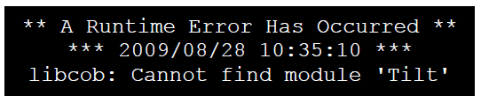

#### 8.3.1.24. CALL “CBL_EXIT_PROC” USING *function, program-pointer*

このルーチンは、一般的な終了処理ルーチンを登録する。

*function*の引数は、値が0または1の数字定数または32ビットのバイナリ COMP-5 データ項目 (例えばUSAGE BINARY-LONG)でなければならない。値 0 は終了手続きを登録 (「インストール」) 、値 1 は以前にインストールされた終了手続きを登録解除 (「アンインストール」) することを意味する。

*program-pointer* は、終了手続きのアドレスを含む USAGE PROGRAM-POINTER データ項目でなければならない。このようなデータ項目を入力する方法については、6.39.2章で説明している。

成功 (0) または失敗 (0 以外) の結果は、RETURN-CODE レジスタに返される。

「STOP RUN」またはそれに相当するもの(つまりメインプログラムで実行される「GOBACK」)が実行されると、終了手続きがトリガーされる。終了手続きコードが実行され、EXIT PROGRAM または GOBACK が発行されると、システム標準のプログラム終了ルーチンが実行される。

一度に有効にできるユーザ定義の終了手続きは 1 つだけである。

終了手続きはメインプログラムまたはサブプログラムによって定義できるが、登録された場所に関係なくプログラムコンパイルユニット全体に適用され、実行可能プログラムの<u>どこかで</u>STOP RUN が実行されたときにトリガーされる。終了手続きがサブプログラムによって定義された場合、終了手続きの実行時にそのプログラムをロードする<u>必要がある</u>。

終了手続きは、EXIT PROGRAM または GOBACK を使用して終了する必要がある。

以下は、終了手続きを登録するopensource COBOLプログラムのサンプルである。プログラムの出力結果も示している。

        IDENTIFICATION DIVISION.
          PROGRAM-ID. demoexitproc.
          ENVIRONMENT DIVISION.
          DATA DIVISION.
          WORKING-STORAGE SECTION.
          78 Exit-Proc-Install          VALUE 0.
          01 Current-Date               PIC X(8).
          01 Current-Time               PIC X(8).
          01 Exit-Proc-Address          USAGE PROCEDURE-POINTER.
          01 Formatted-Date             PIC XXXX/XX/XX.
          01 Formatted-Time             PIC XX/XX/XX.
          PROCEDURE DIVISION.
          000-Register-Exit-Proc.
              SET Exit-Proc-Address TO ENTRY "999-Exit"
              CALL "CBL_EXIT_PROC"
                  USING Exit-Proc-Install, Exit-Proc-Address
              END-CALL
              IF RETURN-CODE NOT = 0
                  DISPLAY 'Error: Could not register Exit Procedure'
              END-IF
          099-Now-Test-Exit-Proc.
              DISPLAY
                  'Executing a STOP RUN...'
              END-DISPLAY
              GOBACK
              .
          999-Exit-Proc.
              ENTRY "999-Exit"
              DISPLAY
                  '*** STOP RUN has been executed ***'
              END-DISPLAY
              ACCEPT
                  Current-Date FROM DATE YYYYMMDD
              END-ACCEPT
              ACCEPT
                  Current-Time FROM TIME
              END-ACCEPT
              MOVE Current-Date TO Formatted-Date
              MOVE Current-Time TO Formatted-Time
              INSPECT Formatted-Time REPLACING ALL '/' BY ':'
              DISPLAY
                  '*** ' Formatted-Date ' ' Formatted-Time ' ***'
              END-DISPLAY
              GOBACK
              .

プログラムの出力結果は･･･

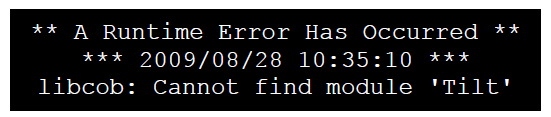

#### 8.3.1.25. CALL “CBL_EQ” USING *item-1, item-2*, BY VALUE *byte-length*

このサブルーチンは、項目-1 と項目-2 の左端の 8* *byte-length*の位置同士のビットが等しいかどうか、ビット単位のテストを実行し、結果のビット文字列を項目-2 に格納する。

項目-1 は英数字定数またはデータ項目で、項目-2 はデータ項目である必要がある。項目-1 と 項目-2 の長さは、少なくとも 8* *byte-length* でなければならない。

byte-lengthは数字定数またはデータ項目であり、**BY VALUE**で指定する必要がある。

下の真理値表は「EQ」プロセスを示している。

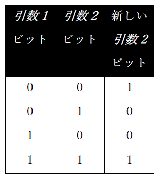

項目-2 の 8* *byte-length* ポイントの後のビットは影響を受けない。
結果のゼロが RETURN-CODE レジスタに戻される。

#### 8.3.1.26. CALL “CBL_FLUSH_FILE” USING *file-handle*

このサブルーチンをMicro Focus COBOLでCALLすると、*file-handle*が引数として指定された (出力) ファイルの未書込みメモリバッファがディスクに書き込まれる。

このルーチンはopensource COBOL では機能しない。Micro Focus COBOL 用に開発されたアプリケーションに互換性を提供するためだけに存在する。

#### 8.3.1.27. CALL “CBL_GET_CURRENT_DIR” USING BY VALUE 0, BY VALUE *length*, BY REFERENCE *buffer*

現在のディレクトリの完全修飾パス名が取得され、指定された*buffer*にパス名の *length*文字が保存される。

第1引数は使用されないが、**BY VALUE** で指定する必要がある。

*length*引数は **BY VALUE** で指定する必要がある。

*buffer* 引数は **BY REFERENCE** で指定する必要がある。

*length*引数 (数字定数またはデータ項目) に指定する値は、*buffer*引数の長さを超えてはならない。

*length*引数に指定された値が *buffer*引数の長さよりも小さい場合、現在のディレクトリパスは左寄せされ、*buffer*の最初の *length*バイト内に空白が埋められる―そのポイント以降の*buffer*内のバイトは変更されない。

ルーチンが成功すると、0の値が RETURN-CODE レジスタに返される。引数(負または 0 lengthなど)が原因でルーチンが失敗した場合、RETURN-CODEの値は128 になる。第1引数の値がゼロ以外の場合、ルーチンは RETURN-CODEが129で失敗する。

#### 8.3.1.28. CALL “CBL_IMP” USING *item-1, item-2*, BY VALUE *byte-length*

このサブルーチンは、ビット単位の「包含」演算を項目-1 と項目-2 の左端の 8* *byte-length*の位置同士のビットで実行し、結果のビット文字列を項目-2 に格納する。

項目-1 は英数字定数またはデータ項目で、項目-2 はデータ項目である必要がある。項目-1 と 項目-2 の長さは、少なくとも 8* *byte-length* でなければならない。

*byte-length*は数字定数またはデータ項目であり、**BY VALUE**で指定する必要がある。

下の真理値表は「IMP」プロセスを示している。


項目-2 の 8* *byte-length* ポイントの後のビットは影響を受けない。

結果のゼロが RETURN-CODE レジスタに戻される。

#### 8.3.1.29. CALL “CBL_NIMP” USING *item-1, item-2*, BY VALUE *byte-length*

このサブルーチンは、ビット単位の否定「包含」演算を項目-1 と項目-2 の左端の 8* *byte-length*の位置同士のビットで実行し、結果のビット文字列を項目-2 に格納する。

項目-1 は英数字定数またはデータ項目で、項目-2 はデータ項目である必要がある。項目-1 と 項目-2 の長さは、少なくとも 8* *byte-length* でなければならない。

*byte-length*は数字定数またはデータ項目であり、**BY VALUE**で指定する必要がある。

下の真理値表は「NIMP」プロセスを示している。

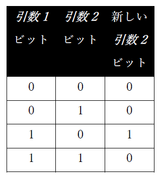

項目-2 の 8* *byte-length* ポイントの後のビットは影響を受けない。

結果のゼロが RETURN-CODE レジスタに戻される。

#### 8.3.1.30. CALL “CBL_NOR” USING *item-1, item-2*, BY VALUE *byte-length*

このサブルーチンは、ビット単位の否定OR演算を項目-1 と項目-2 の左端の 8* *byte-length*の位置同士のビットで実行し、結果のビット文字列を項目-2 に格納する。

項目-1 は英数字定数またはデータ項目で、項目-2 はデータ項目である必要がある。項目-1 と 項目-2 の長さは、少なくとも 8* *byte-length* でなければならない。

*byte-length*は数字定数またはデータ項目であり、**BY VALUE**で指定する必要がある。

下の真理値表は「NOR」プロセスを示している。

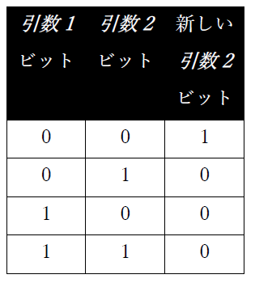

項目-2 の 8* *byte-length* ポイントの後のビットは影響を受けない。

結果のゼロが RETURN-CODE レジスタに戻される。

#### 8.3.1.31. CALL “CBL_NOT” USING *item-1*, BY VALUE *byte-length*

このサブルーチンは、項目-2 の左端の 8* *byte-length*のビットを「反転」し、結果のビット文字列を項目-2 に格納する。

項目-2 はデータ項目である必要があり、項目-2 の長さは少なくとも 8* *byte-length* でなければならない。

byte-lengthは数字定数またはデータ項目であり、**BY VALUE**で指定する必要がある。

下の真理値表は「NOT」プロセスを示している。


項目-2 の 8* *byte-length* ポイントの後のビットは影響を受けない。

結果のゼロが RETURN-CODE レジスタに戻される。

#### 8.3.1.32. CALL “CBL_OC_KEISEN” USING *item-1*

CBL_OC_KEISENは、画面に縦・横の罫線を表示することができる。

item-1として次の集団項目を定義する。

        01 KEISEN.
          02 KEI-CMD   PIC 9(1) COMP-X.
          02 KEI-LINE  PIC 9(2) COMP-X.
          02 KEI-COL   PIC 9(2) COMP-X.
          02 KEI-LNG1  PIC 9(2) COMP-X.
          02 KEI-LNG2  PIC 9(2) COMP-X.
          02 KEI-COLOR PIC 9(2) COMP-X.
          02 KEI-PRN   PIC 9(2) COMP-X.

各項目の意味を以下に示す。

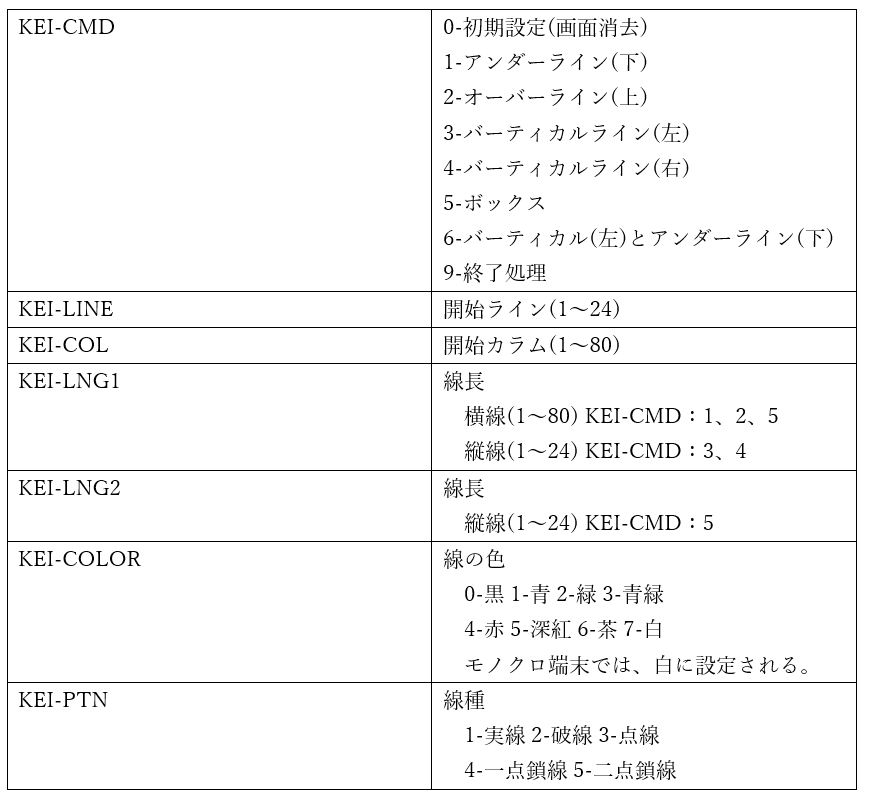

#### 8.3.1.33. CALL “CBL_OC_NANOSLEEP” USING *nanoseconds-to-sleep*

CBL_OC_NANOSLEEP は、指定されたナノ秒数だけプログラムをスリープ状態にする。

*nanoseconds-to-sleep* 引数は数字定数またはデータ項目である。

1 秒は 10 億ナノ秒であるため、プログラムを 1/4 秒間スリープさせたい場合は、*nanoseconds-to-sleep*の値に 250000000 を設定する。

[8.3.1.11章](8-3-1.md#83111-call-csleep-using-seconds-to-sleep)―**C$SLEEP** を参照

#### 8.3.1.34. CALL “CBL_OPEN_FILE” *file-path, access-mode*, 0, 0, *handle*

このルーチンは、**CBL_WRITE_FILE** または **CBL_READ_FILE** で使用できる既存のファイルを開く。

*file-path* 引数は、英数字定数またはデータ項目である。

*access-mode* 引数は、PIC X USAGE COMP-X (または USAGE BINARY-CHAR) で定義された数字定数またはデータ項目である。次のようにファイルの使用方法を指定する。

        1 = 入力 (読み取り専用)
        2 = 出力 (書き込み専用)
        3 = 入力または出力

第3、第4引数ではロックモードとデバイス仕様を指定するが、opensource COBOL には実装されていない (少なくとも現時点では)―それぞれに 0 を指定する。

最後の引数―*handle*―はPIC X(4) USAGE COMP-X 項目で、ファイルへのハンドルを受け取る。ハンドルは特定のファイルを参照するために、他のバイトストリーム関数で使用される。

RETURN-CODE -1の値は無効な引数、 0の値は成功を示す。35の値はファイルが存在しないことを意味する。

[8.3.1.20章](8-3-1.md#83120-call-cbl_create_file-using-file-path-2-0-0-file-handle)―**CBL_CREATE_FILE**を参照

#### 8.3.1.35. CALL “CBL_OR” USING *item-1, item-2*, BY VALUE *byte-length*

このサブルーチンは、ビット単位のOR演算を項目-1 と項目-2 の左端の 8* *byte-length*の位置同士のビットで実行し、結果のビット文字列を項目-2 に格納する。

項目-1 は英数字定数またはデータ項目で、項目-2 はデータ項目である必要がある。項目-1 と 項目-2 の長さは、少なくとも 8* *byte-length* でなければならない。

*byte-length*は数字定数またはデータ項目であり、**BY VALUE**で指定する必要がある。

下の真理値表は「OR」プロセスを示している。

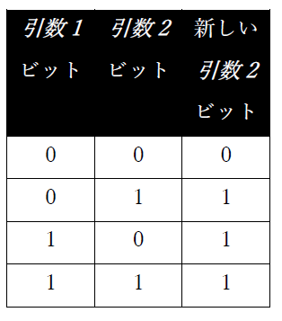

項目-2 の 8* *byte-length* ポイントの後のビットは影響を受けない。

結果のゼロが RETURN-CODE レジスタに戻される。

#### 8.3.1.36. CALL “CBL_READ_FILE” USING handle, offset, nbytes, flag, buffer

このルーチンは、*handle*で定義されたファイルから指定された*buffer*に、バイト番号*offset*で始まる *nbytes* のデータを読み取る。

*handle*引数 (PIC X(4) USAGE COMP-X) は、CBL_OPEN_FILE への事前の呼び出しによって取り込まれている必要がある。

*offset*引数 (PIC X(8) USAGE COMP-X) は、読み取るファイルの最初のバイト位置を定義する。ファイルの最初のバイトは、バイトオフセット 0 である。

*nbytes* 引数 (PIC X(4) USAGE COMP-X) は、読み取るバイト数(最大値)を指定する。

*flags* 引数が 128 として指定されている場合、ファイルのサイズ (バイト単位) が完了時にファイルオフセット引数 (引数 2) に返される。`41`それ以外に有効な*flags* の値は 0 だけである。この引数は、数字定数または PIC X USAGE COMP-X データ項目として指定される。数に指定されたファイルに移動する。これは、最初に *old-file-path

完了時に、読み取りが成功した場合は RETURN-CODE が 0 に設定され、「ファイルの終わり」条件が発生した場合は 10 に設定される。RETURN-CODE の値が -1 の場合、サブルーチン引数に問題が確認されたことを示す。

#### 8.3.1.37. CALL “CBL_RENAME_FILE” USING *old-file-path, new-file-path*

このサブルーチンを使用してファイル名を変更できる。

*old-file-path* で指定されたファイルは、*new-file-path* で指定された名前に「名前変更」される。それぞれの引数は英数字定数またはデータ項目である。

このルーチン名で気づくかもしれないが、このルーチンには単なる「名前変更」以上の機能がある―1 番目の引数に指定されたファイルを 2 番目の引数に指定されたファイルに移動する。これは、最初に *old-file-path* を *new-file-path* にコピーし、次に *old-file-path* を削除するという 2 段階の順序と考えられる。

ファイルの移動に失敗した場合 (例えば、ファイルが存在しない場合)、RETURN-CODE は 128 に設定され、正常終了すると0 に設定される。

#### 8.3.1.38. CALL “CBL_TOLOWER” USING *data-item*, BY VALUE *convert-length*

このルーチンは、*convert-length* (数字定数またはデータ項目) の *data-item* (英数字一意名) の先頭文字を小文字に変換する。

*convert-length* 引数は、**BY VALUE** で指定する必要がある。*data-item* の (先頭) 文字がいくつ変換されるかを指定し、それ以降の文字は変更されない。

*convert-length* が負またはゼロの場合、変換は実行されない。

[8.3.1.12章](8-3-1.md#83112-call-ctolower-using-data-item-by-value-convert-length)―**C$TOLOWER**を参照

#### 8.3.1.39. CALL “CBL_TOUPPER” USING *data-item*, BY VALUE *convert-length*

C$TOUPPER サブルーチンは、*convert-length* (数字定数またはデータ項目) の *data-item* (英数字一意名) の先頭文字を大文字に変換する。

*convert-length* 引数は、**BY VALUE** で指定する必要がある。*data-item* の (先頭) 文字がいくつ変換されるかを指定し、それ以降の文字は変更されない。

*convert-length* が負またはゼロの場合、変換は実行されない。

[8.3.1.13章](8-3-1.md#83113-call-ctoupper-using-data-item-by-value-convert-length)―**C$TOUPPER**を参照

#### 8.3.1.40. CALL “CBL_WRITE_FILE” USING *handle, offset, nbytes, 0, buffer*

このルーチンは、指定された*buffer*から*handle*で定義されたファイルに、*nbytes* のデータをバイト番号*offset*から書き込む。

*handle*引数 (PIC X(4) USAGE COMP-X) は、CBL_OPEN_FILE への事前の呼び出しによって取り込まれている必要がある。

*offset*引数 (PIC X(8) USAGE COMP-X) は、書き込まれるファイルの最初のバイト位置を定義する。ファイルの最初のバイトは、バイトオフセット 0 である。

*nbytes* 引数 (PIC X(4) USAGE COMP-X) は、書き込まれるバイト数(最大値)を指定する。
唯一の許容値または flags 引数は 0 である。この引数は、数字定数または PIC X USAGE COMP-X データ項目として指定される。

完了時に、書き込みが成功した場合は RETURN-CODE が 0 に設定され、I/O エラー条件が発生した場合は 30 に設定される。RETURN-CODE の値が -1 の場合、サブルーチン引数に問題が確認されたことを示す。

#### 8.3.1.41. CALL “CBL_XOR” USING *item-1, item-2*, BY VALUE *byte-length*

このサブルーチンは、ビット単位の排他的OR演算を項目-1 と項目-2 の左端の 8* *byte-length*の位置同士のビットで実行し、結果のビット文字列を項目-2 に格納する。

項目-1 は英数字定数またはデータ項目で、項目-2 はデータ項目である必要がある。項目-1 と 項目-2 の長さは、少なくとも 8* *byte-length* でなければならない。

*byte-length*は数字定数またはデータ項目であり、**BY VALUE**で指定する必要がある。

下の真理値表は「XOR」プロセスを示している。

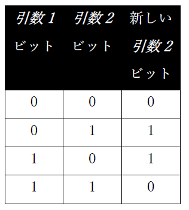

項目-2 の 8* *byte-length* ポイントの後のビットは影響を受けない。

結果のゼロが RETURN-CODE レジスタに戻される。

#### 8.3.1.42. CALL “SYSTEM” USING *command*

このサブルーチンは、指定された*command* (英数字定数またはデータ項目) をコマンドシェルに送信する。

CALL を SYSTEM に発行する opensource COBOL プログラムに従属するシェルが開かれる。

コマンドからの出力 (コマンドが存在する場合) は、opensource COBOL プログラムが実行されたコマンドウィンドウに表示される。

Unix システムでは、シェル環境は標準のシェルプログラムを使用して構築される。これは、Cygwin Unix エミュレータで作成された opensource COBOL ビルドを使用する場合も同様である。

ネイティブ Windows Windows/MinGW ビルドでは、シェル環境は使用している Windows のバージョンに適した Windowsコンソールウィンドウコマンドプロセッサ (通常は「cmd.exe」) となる。

実行されたコマンドからの出力をトラップしてopensource COBOL プログラム内で処理するには、パイプ (>) を使用してコマンド出力を一時ファイルに送信し、制御が戻ったらプログラム内から読み取る。

---
`38` ファイルサイズ情報は、使用している特定の opensource COBOLビルド/オペレーティングシステムの組み合わせでは利用できず常にゼロとして返される場合がある。<br>
`39` ファイルサイズ情報は、使用している特定の opensource COBOLビルド/オペレーティングシステムの組み合わせでは利用できず常にゼロとして返される場合がある。<br>
`40` **CBL_CREATE_FILE** は**CBL_OPEN_FILE** ルーチンの特殊なケースであるため、引数 2、3、および 4 の意味についてCBL_OPEN_FILEルーチンで説明している。<br>
`41` すべてのオペレーティングシステム/opensource COBOL 環境でファイルサイズを取得できるわけではない―そのような場合、ゼロの値が返される。<br>
